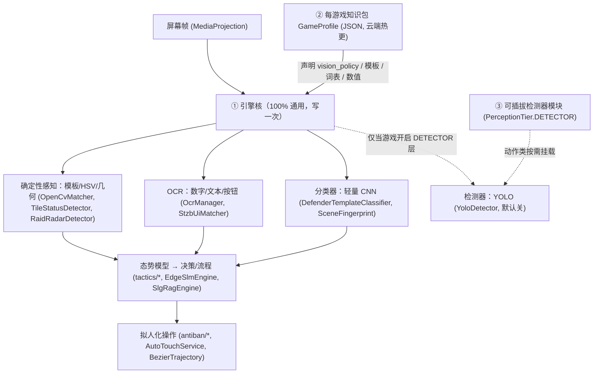

# 多游戏引擎分层蓝图 · 确定性优先 + 模型升级阶梯

> **一句话**：一套**通用引擎核** + 每游戏一个**知识包** + 一个**默认关、可插拔的检测器模块**。
> 视觉感知按「**升级阶梯**」从便宜到贵逐级启用，**只有下一级被真机实测证明兜不住某个具体缺口时，才爬一级**。
> 本蓝图同时是**代码事实**的说明——文中每个概念都能在下述源文件里找到对应实现。

---

## 一、三层架构

| 层 | 职责 | 换游戏时 | 代表实现 |
| :-- | :-- | :-- | :-- |
| **① 引擎核** | 截屏→感知→态势→决策→拟人触控，全游戏复用 | **不改逻辑**（授权链路除外，见 §七） | `ScreenCaptureService`、`ocr/*`、`tactics/*`、`antiban/*`、`service/EngineBridge` |
| **② 知识包** | 模板图、UI 语义词表、OCR 词表、数值、**感知层级策略** | **主要改这里**（发 JSON，不改代码） | `knowledge/GameProfile.kt`（JSON 可云热更） |
| **③ 检测器模块** | 密集/遮挡/跨缩放多目标 | **按需插** | `ai/vision/YoloDetector.kt`（默认关） |

> 关键红利：**加一款游戏不用改引擎核**——但不等于"只用发一个 JSON"。
> 知识包之外还有**该游戏自己的像素资产与权重**必须补（模板图、YOLO 权重、RAG 语料、意图权重），
> 这些不是代码问题，是数据问题，谁也变不出来。
> 实测口径由闸门守着并可打印：`python tools/check_multi_game_readiness.py --show-checklist`。

---

## 二、模型升级阶梯（PerceptionTier）

> 实现：`client/.../ai/vision/PerceptionTier.kt`。成本自下而上单调递增。

| 层级 | 解决什么 | 数据成本 | 端侧(无 GPU / 185MB) | 何时用 |
| :-- | :-- | :-- | :-- | :-- |
| **DETERMINISTIC** | 模板匹配 + 颜色/HSV + 几何 | **零** | ✅ 极轻 | 默认打底，一切从这里开始 |
| **OCR** | 读数字/文本/按钮（兵堆数量、守军、界面词） | 零（现成模型） | ✅ | 默认开 |
| **CLASSIFIER** | 轻量 CNN 分类：建筑等级/稀有度/buff/场景 | **几百张裁剪**（不画框） | ✅ 几 MB | 模板太脆时补，**优先于检测器** |
| **DETECTOR** | YOLO 目标检测：密集/遮挡/跨缩放多目标 | 几千框 + GPU | ⚠️ 勉强 | **仅**动作类 / 连续 3D 地图 |
| **POLICY** | 决策/操作策略（规则微脑 / RL / 行为克隆） | 极高 | ⚠️ | 实时动作类"会玩"才需 |

**升级铁律（防过度设计）**：
1. 永远先用**最便宜**的层级把功能跑通；
2. 只有当某个**具体场景**在真机上被证明"下一级兜不住"，才允许爬一级；
3. 爬级前必须能说清"**是哪一类目标、什么失败模式、为什么确定性不行**"——说不出就不上。

---

## 三、每类游戏默认用哪级（VisionPolicy）

> 实现：`VisionPolicy` 的三个预设 + `GameProfile.visionPolicy`（默认 `SLG_DEFAULT`，Fail-Closed）。

| 游戏族 | 默认层级 | 含 DETECTOR(YOLO)? | 判据 |
| :-- | :-- | :-- | :-- |
| **SLG 沙盘**（率土/三战/谋定/RoK） | DETERMINISTIC + OCR + CLASSIFIER | ❌ **不用** | 格子地图 + 归属色 + 兵堆**数字角标** + 可锁缩放 + 全模板贴图 |
| **SLG 连续 3D**（无尽的拉格朗日） | 同上，**边缘可开 DETECTOR** | ⚠️ 按需 | 连续太空、3D 舰船旋转/缩放/密集舰队——确定性吃力的那部分才补 |
| **回合 MMO**（梦幻西游） | DETERMINISTIC + OCR | ❌ 不用 | 回合制、重 UI 流程、战斗固定站位 |
| **实时动作**（DNF 手游） | 全开（含 DETECTOR + POLICY） | ✅ **必须** | 实时、动态、满屏特效、密集遮挡、非模板 |

### 逐游戏落位
| 游戏 | 族 | vision_policy | 备注 |
| :-- | :-- | :-- | :-- |
| 率土之滨 | SLG | `SLG_DEFAULT` | **本命盘，去 YOLO，确定性 + OCR 打底** |
| 三国志·战略版 | SLG | `SLG_DEFAULT` | 与率土同构，复用引擎核；界面按钮仍需它自己的模板图与语义词表 |
| 三国：谋定天下 | SLG | `SLG_DEFAULT` | 同上；个别等级/稀有度难分→加 CLASSIFIER |
| 万国觉醒 RoK | SLG | `SLG_DEFAULT` | 图标化地图，模板匹配友好 |
| 无尽的拉格朗日 | SLG-3D | `SLG_DEFAULT`(+按需 DETECTOR) | 先确定性打底，舰队识别实测不行的那类再补检测器 |
| 梦幻西游手游 | MMO | `MMO_DEFAULT` | 价值在流程 + OCR |
| DNF 手游 | 动作 | `ACTION_DEFAULT` | 独立技术栈、独立风险，**单独立项、排最后** |

---

## 四、代码落地（本蓝图已写入实现，名实相符）

| 变更 | 文件 | 作用 |
| :-- | :-- | :-- |
| 新增感知阶梯抽象 | `ai/vision/PerceptionTier.kt` | `enum PerceptionTier` + `data class VisionPolicy`（含 `SLG_DEFAULT/MMO_DEFAULT/ACTION_DEFAULT` + JSON 往返） |
| 知识包声明层级 | `knowledge/GameProfile.kt` | 新增 `visionPolicy`（默认 `SLG_DEFAULT`），`toJson/fromJson` 支持；**旧缓存无该字段→回退 SLG_DEFAULT，绝不误开检测器** |
| 执行闸门 | `runtime/VisionRuntime.kt` | **闸门 0**：`policy` 不含 `DETECTOR` 时 `yolo()` 直接返回 null（权重存在也不加载）；调用方已按 null 优雅降级到确定性 |
| 激活同步 | `knowledge/KnowledgeBaseManager.kt` | 切游戏/热更时经 `setActiveProfile()` 把 `visionPolicy` 同步给 `VisionRuntime.policy` |
| 检测器重定位 | `ai/vision/YoloDetector.kt` | KDoc 明确其为**默认关、可插拔的 DETECTOR 层**；7 类契约保留仅为"真要上检测器时按图训练"，不代表率土依赖 |

> **效果**：率土（`SLG_DEFAULT`）运行时 `VisionRuntime.yolo()` 恒为 null → 全链路走确定性，YOLO 即便有权重也不参与；
> 未来 DNF 在其知识包写 `"vision_policy":["...","DETECTOR","POLICY"]` 就能让检测器层参与调度，**这一段确实不用改引擎核**。
> 但要跑起来还得给它 `models/yolo26s_<gameId>.param/.bin` 这份权重（名字由 `PerGameScope.assetNameCandidates()` 派生，
> 单一权威在 `ai/assets/ModelAssetManager.kt`）——**权重不在，策略开了也只是如实报缺失**。

---

## 五、数据与标注策略（吸取率土 YOLO 教训）

1. **能确定性就不 ML；能分类就不检测**——分类器只要几百张裁剪，绕开"逐个体画框"这个坑。
2. **真到检测器那步也不手标几千框**：用确定性层先自动圈候选区 → 半自动 → **bootstrap 自训练**（`tools/train_yolo/prelabel.py`），且**只训真缺的那一类**。
3. **锁定地图缩放**是 SLG 自动化的前提——尺度一定，模板匹配近乎完美，直接消灭 YOLO 最大的存在理由。

---

## 六、推进波次（"每款都想要"的正确姿势：愿景全要，落地有序）

| 波次 | 内容 | 依赖 |
| :-- | :-- | :-- |
| 1 | **率土确定性核 + 真机验证(Phase E)** | 现在 |
| 2 | 三战 / RoK / 谋定 —— 加知识包 **+ 该游戏的模板图与词表** | 波次 1 引擎核 |
| 3 | 梦幻西游 —— MMO 流程 + OCR | 引擎核复用 |
| 4 | 无尽的拉格朗日 —— 按需插 DETECTOR(小) | 检测器插件接口 |
| 5 | DNF —— 实时检测 + 策略，**单独立项** | 独立预算/风险 |

---

## 七、边界与风险（诚实声明）
- **确定性会丢的**：重度重叠兵团的**精确个体计数**（用色块团 + 数字角标做**态势估计**替代，够用）。
- **维护成本**：美术改版需更新模板/词表（远轻于重训模型）。
- **动作类是另一物种**：实时低延迟 + 强反外挂 + 高频改版，别和 SLG 绑一条 roadmap。
- 本文所述"去 YOLO"仅指**率土/SLG 默认不启用**；检测器作为可插拔模块**保留在代码里**，供动作类按需开启。

---

## 八、"加一款游戏要动什么"——P7 实测结论（不是愿景）

这一节是把上面那句红利**拿去逐条验证**之后写下的。判据可复现：
`python tools/check_multi_game_readiness.py --show-checklist`（该闸门已进全量回归必需项）。

### 已经做到"不用改代码"
| 能力 | 落点 | 不成立时会怎样 |
| :-- | :-- | :-- |
| 知识包采纳有硬闸：语义键全覆盖 / 坐标在屏界内 / 词表非空，不过就拒绝并回落 | `knowledge/GameProfile.kt` `validateFor()` | 半套配置被静默采纳，界面按键全部点空 |
| **纯云端知识包可激活**：内置表缺键不再一票否决，`profile_version` 更高即采纳 | `KnowledgeBaseManager.loadProfileForGame()` | "发了包但全网永远不生效"，且界面上根本没有第二个入口 |
| 可挂接列表 = 内置档案 ∪ 通过校验的沙盒缓存；切换失败**如实报失败** | `getSupportedGames(context)` + `ui/MainActivity.kt` 切换对话框 | 切没切成功都提示"已切换" |
| 本机标定/模板/门槛/语料池**按 gameId 分域**，切游戏自动重载 | `service/PerGameScope.kt` + `UiAnchors`/`MapCoordinateSystem`/`SceneFingerprint`/`ButtonTemplateStore`/`ai/rag/SlgRagEngine` | 换了游戏仍照着上一款游戏的坐标点，且全程无报错 |
| 资产命名双派生：目录 `templates/<gameId>/`，权重 `<base>_<gameId>.<ext>`；**率土继续兼容旧的无标记名**（构建脚本零改名） | `PerGameScope.assetDirs()` / `assetNameCandidates()`，名单唯一权威在 `ai/assets/ModelAssetManager.kt` | 别的游戏吃到率土的界面截图；或"体检判就绪、引擎加载另一套" |

### 仍然必须人工补（"零改动"的说法到此为止）
- **A 像素资产**：新游戏要自己截按钮模板、建 `defender_refs/<gameId>/`。缺了不会崩，但按键定位回落语义 OCR 默认词、守军头像通道不启用。
- **B YOLO 权重**：需自己采集-标注-训练并导出 ncnn（`models/yolo26s_<gameId>.param/.bin`）。仓库里**一份 YOLO 权重都没有**，这是数据缺口，不是代码缺口。
- **C RAG 语料与意图微脑**：需要该游戏自己的向量索引与意图权重，否则检索如实返回空、军令解析回落正则。
- **D 授权链路**：`license/LicenseManager.kt` 仍把 `game_id` 写死成率土（本轮明确不动卡密/激活）。**卖多游戏授权前必须先改这一处**，否则买了别的游戏的授权也验不过。
- **E APK 内置档案（可选）**：想让离线也自带全套知识，就得再加一个 `StzbKnowledgeBase` 式的内置类并登记进 `builtInProfiles`；纯云端游戏离线时只能用已缓存的那份。

### 回退即失败（闸门守的就是上面这几条）
`check_multi_game_readiness.py` 的 R1~R5：游戏 id 字面量必须逐条登记（登记表自己失效也算失败）、
权重文件名只允许一处权威、分域落盘必须注册重载钩子、游戏专属资产目录必须走候选、
纯云端激活硬闸不许回来。**这五条坏掉时 App 不报错、不降级，只表现为"识别还是上一款游戏"**，
所以列成构建必需项，而不是等真机上发现。
